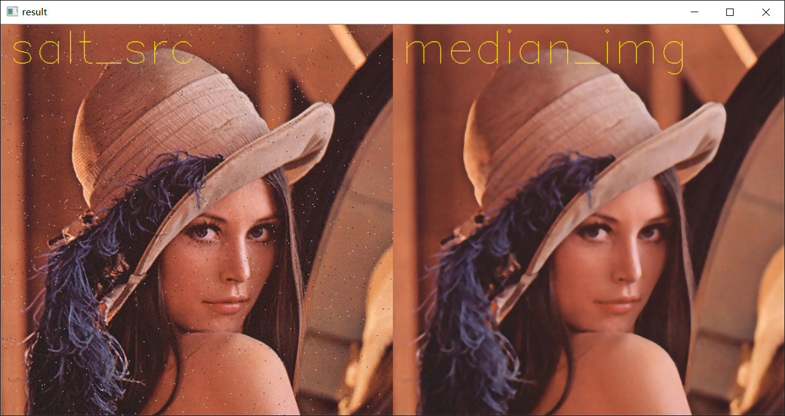

# 图像二值化与去噪    

## 图像噪声   

主要分为两种噪声，有的是因为数字信号在传输过程中出现丢失或者干扰，还有的是因为成像设备发生的错误     

* 椒盐噪声   

    随机在图像出现的稀疏分布的黑白像素点，对于这种噪声的一种有效的去噪方法就是**中值滤波**    

           

* 高斯噪声/符合高斯分布    

    一般会在数码相机的像素采集阶段产生       

    

* 代码实现      

    模拟了为图像增加椒盐噪声和高斯噪声     

    [C++版本](./GenerateNoise/GenerateNoise.cpp)   

    [Python版本](./GenerateNoise/GenerateNoise.py)  
    

## 图像中值滤波       

中值滤波是统计排序滤波器的一种，常见的统计排序滤波器还有最小最大值滤波器，中值滤波对于特定噪声(椒盐噪声)会取得较好的去噪效果    

中值滤波也是一个`x*x`的窗口在图像上滑动，在OpenCV中窗口的size只能为奇数，为了方便求到像素中位数，将中位数作为中心像素点的像素。      

    

* 代码实现    

    [C++版本](./MedianFilter/MedianFilter.cpp)   

    [Python版本](./MedianFilter/MedianFilter.py)     

    

