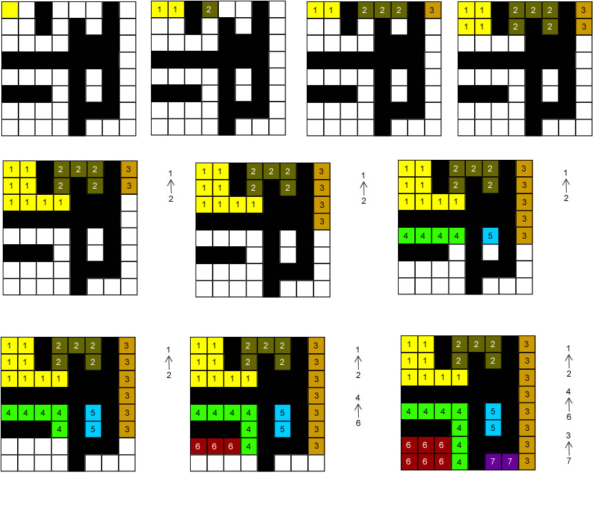
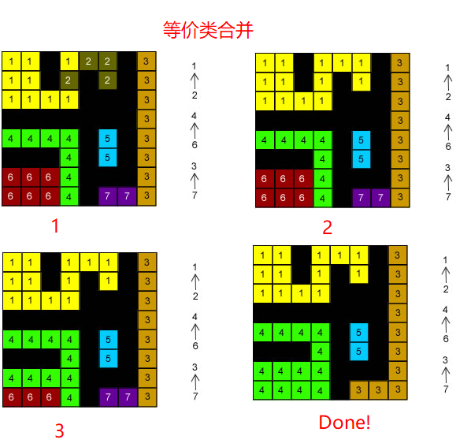
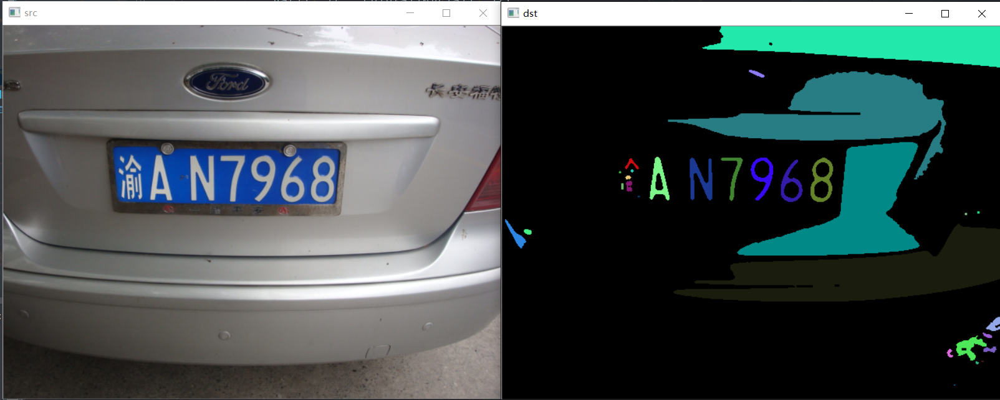

# 图像轮廓分析   

## 图像联通组件寻找     

图像联通组件是图像轮廓分析的基础步骤，就是通过扫描图像的每一个像素点，对于像素值相同的并且连通(八连通或四连通)分为相同的group，最终，给图像中的每个像素点加上一个label，并返回。  
对于一副有N个像素的图像来说，最大联通组件个数为`N/2`，就是相邻的每个像素都是一个独立的group，在OpenCV中，调用查找函数时，必须保证图像像素背景是黑色，前景像素是白色(二值图像)  

* 两步法  

    * 扫描像素   

        

        查看当前像素的左侧一个和上侧一个像素是否相同和连通，如果图像左侧像素和上侧像素出现分歧，优先选择左侧像素为等价类    

    * 合并等价类    

        


```C++
//输出的带标记图像
Mat labels = Mat::zeros(img.size(), CV_32S);
//第一个参数必须为二值图像，黑色背景,因为这里黑色背景的label值为0
//第三个参数表示在八连通域查找
//第四个参数表示输出labels图像的数据类型，默认为带符号整形CV_32S
int num_labels = connectedComponents(binary, labels, 8, CV_32S);
```  


  

* 代码实现   

    [C++版本](./ConnectedComponent/ConnectedComponent.cpp)    

    [Python版本](./ConnectedComponent/ConnectedComponent.py)   

## 带统计信息的图像联通组件查找    

在上一节内容的基础上，多返回了关于联通组件的一些统计信息   

返回一个stats对象，每个联通组件都有一个结构体，包含了以下信息：  

* 组件左上角点的坐标   

    `cv.STAT_LEFT`, `cv.STAT_TOP`         

* 组件的面积大小    
    
    `cv.STAT_AREA`   

* 组件外接矩形的尺寸     

    `cv.STAT_WIDTH`,`cv.STAT_HEIGHT`    

* 组件的中心点坐标   

    `centroids`       


## 图像轮廓查找并绘制        

通过图像联通组建查找我们可以得到图像的一些联通区域，以及它们的一些统计信息，但是我们还无法得到各个组件之间的层次关系和几何拓扑关系，使用`findContours`可以得到图像中存在的轮廓信息，然后使用`drawContours`可以直接将轮廓绘制出来，方便后续的分析     

     

* 代码   

    [C++版本](./FindContoursAndDraw/FindContourAndDraw.cpp)     

    [Python版本](./FindContoursAndDraw/FindContourAndDraw.py)


