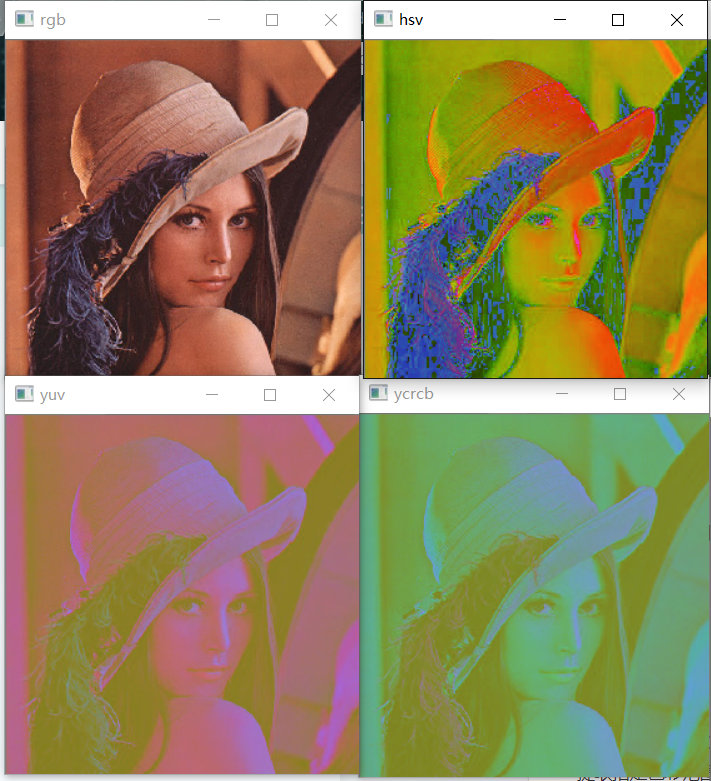
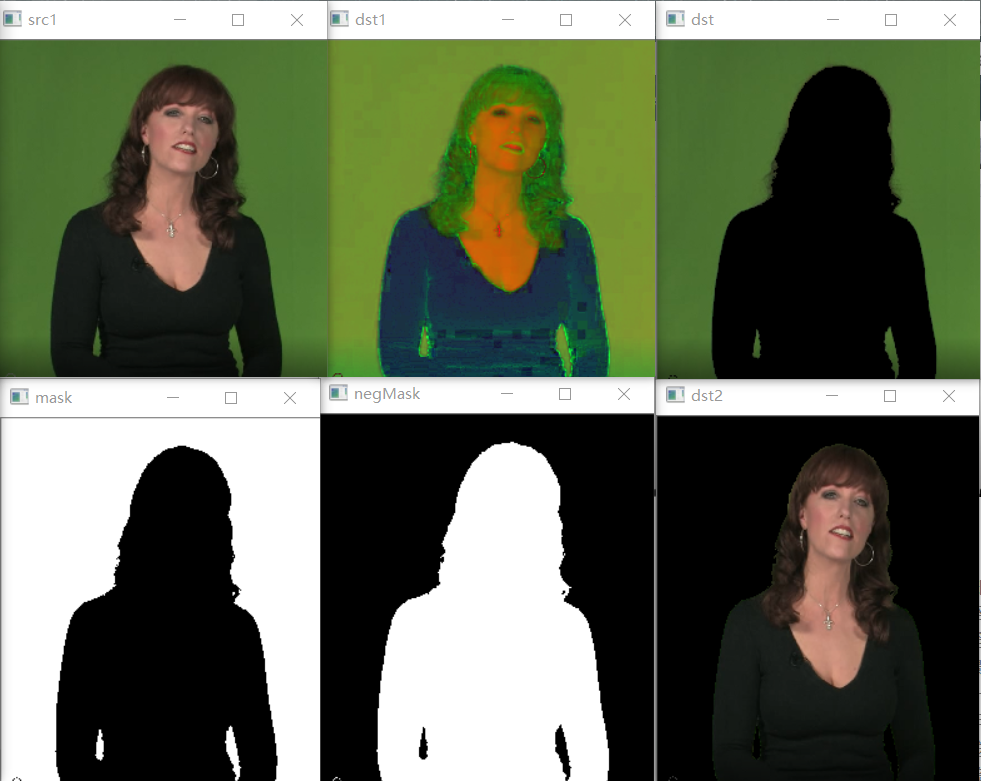

## 像素色彩空间转换     

* 转换函数      

    `cvtColor(src, cv.type2type)`       

* RGB空间    

    最常用的色彩空间，RGB三原色组合起来可以有`256x256x256` 1600万多种颜色      

* HSV空间(hue,saturation,value)       

    色调、饱和度、亮度色彩空间，这是根据人对像素的感受敏感程度提出的一种色彩空间，人类对亮度的敏感度要强于色彩，使用这种色彩空间做图像处理更贴近我们的直观感受       

    HSV空间在做一些图像直方图相关的操作中会有特殊的效果    

    标准的hue色调取值是`0-360`，但是在OpenCV中被规定为了`0-180`       

* YUV空间    

    YUV是早期欧洲电视行业的标准，与设备有关，Android系统摄像机采集图像的第一个形式的色彩空间就是YUV         

* YCrCb空间        

    YCrCb色彩空间常用在电视显示中，在皮肤检测中，对颜色的统计效果也比较好          

* 代码实现    

    进行了图像色彩空间的转换，同时使用在HSV空间下使用`inrange()`对感兴趣的像素进行了提取，结合mask和像素逻辑操作实现了抠图。   

    * 效果如下：    

             

               

        所用的测试图片均在[测试图片](./image)文件夹下    

     * 代码     

        [Python](./cvtColorSpace.py)              

        [C++]()    

    
