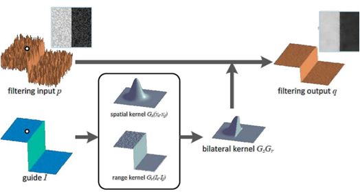
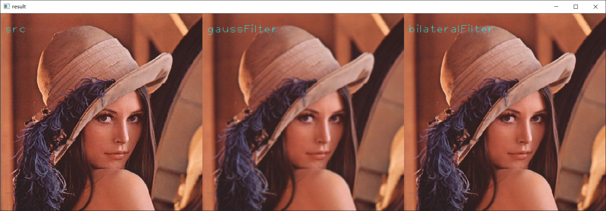

## 图像边缘保留滤波算法     

普通的图像模糊算法，不管是均值模糊还是高斯模糊，他们在滤波过程中都会丢失图像边缘信息，这里的图像边缘指的是在图像中像素跃迁程度较大的区域，不是单纯的图像整体的边缘，如果过分的丢失了图像边缘，就会使图像的对比度降低，下面介绍几种常见的图像边缘保留滤波算法(EPF)      

### 高斯双边滤波     

高斯双边模糊之前是PS中磨皮功能的基础原理    

高斯模糊考虑了图像空间位置对权重的影响，但是没有考虑图像像素分布对卷积输出的影响，双边模糊考虑像素值分布的因素，对像素值空间分布差异较大的范围(往往就是图像边缘，轮廓)进行保留从而较为完整的保留了边缘信息，使图像较为精细。 

...

原理图     

    

这里我进行了普通高斯模糊和双边高斯模糊对同一张图像处理的效果对比，高斯模糊的sigma参数和卷积核大小的取值是相同的

  

* 代码实现   

    [C++版本](./GaussBilateral/GaussBilateralFilter.cpp)

    [Python版本](./GaussBilateral/GaussBilateralFilter.py)

